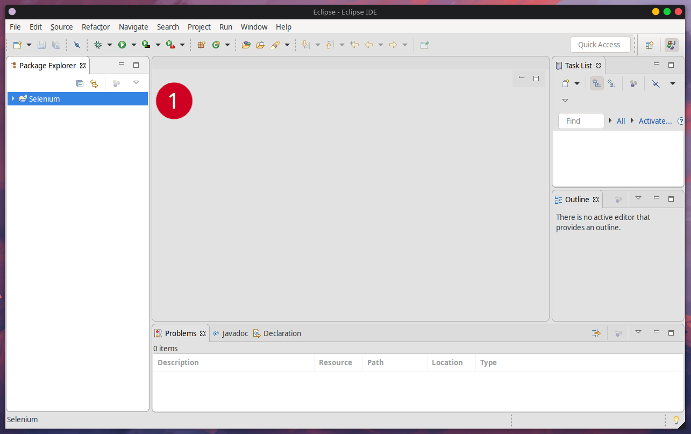
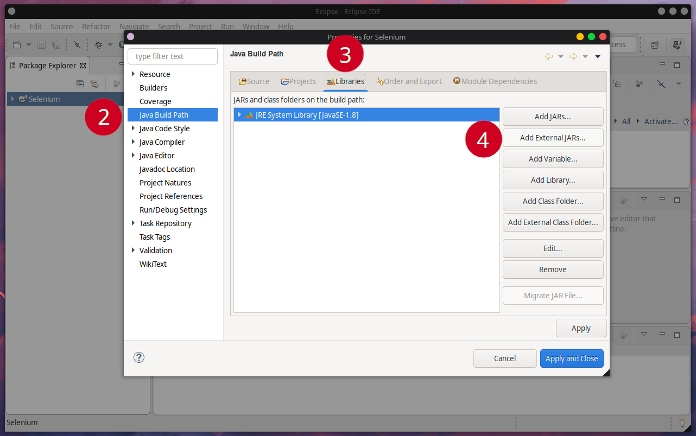
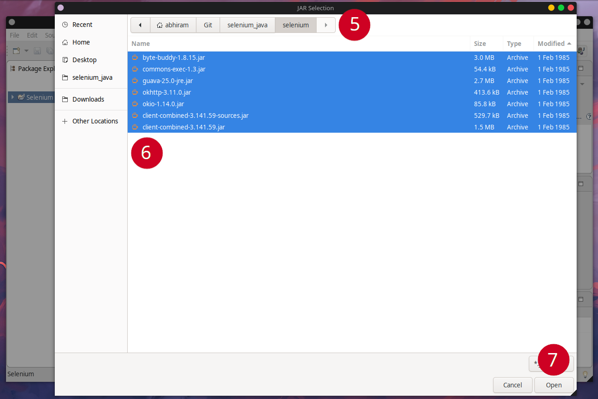
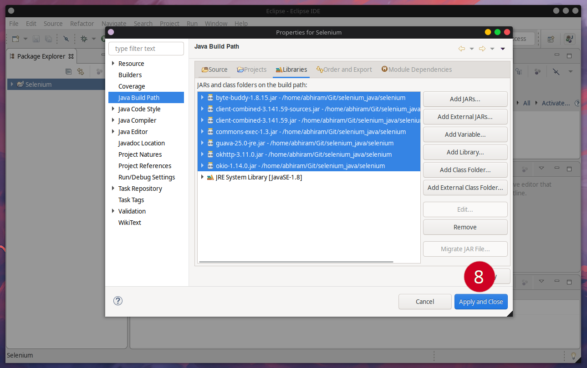

# Selenium Java
Helper Repository for Selenium Classes

## How To Use This Repository

#### 1. Open Eclipse.
#### Highlight Your Project and press ALT + ENTER to open the properties menu.

#### 2. Select "Java Build Path" on the left hand menu.
#### 3. Click "Libraries" on the top navigation bar.
#### 4. Click "Add External Jars" in the right hand menu.

#### 5. In the window that opens, navigate to the folder where you cloned this repo.
#### 6. Select all the jar files in the directory.
#### 7. Click "Open".

#### 8. Click "Apply and Close".
